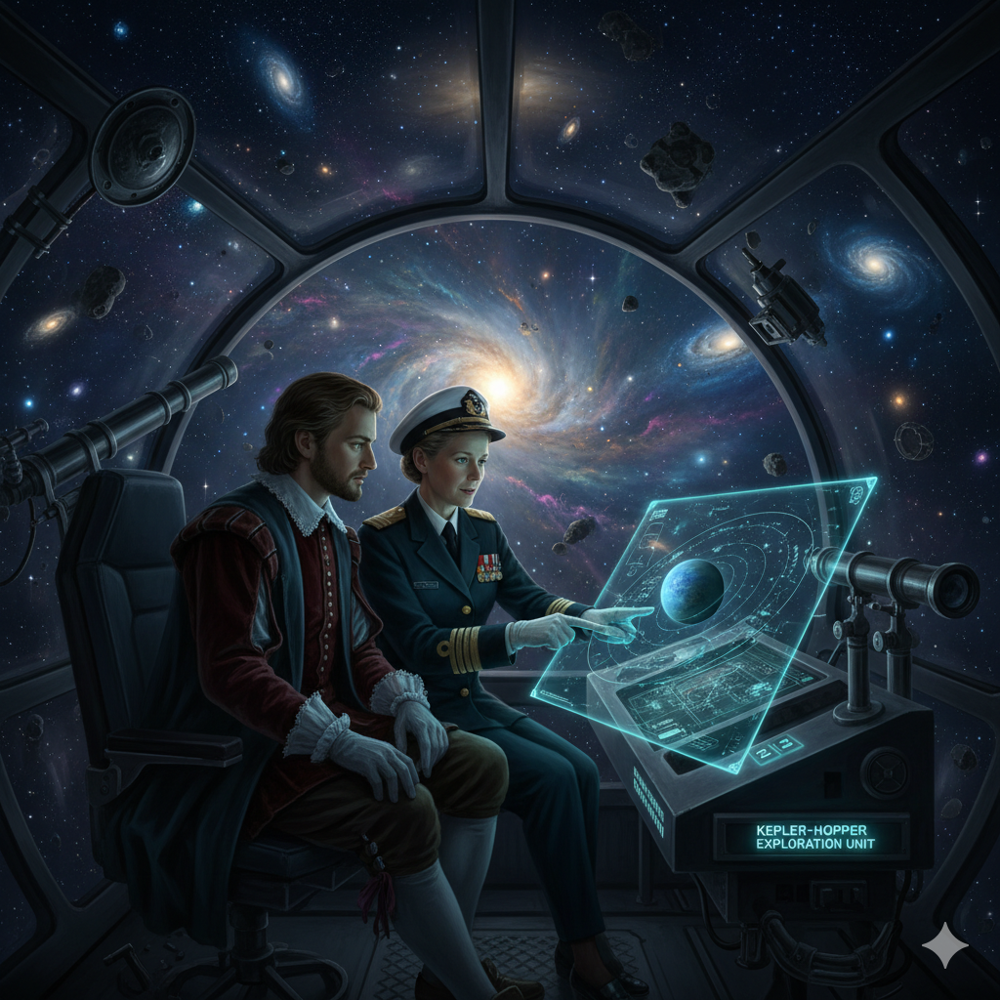
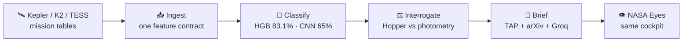
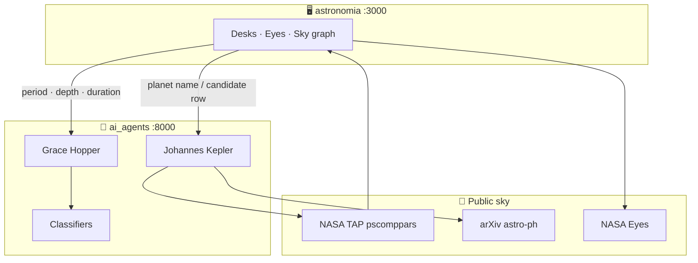
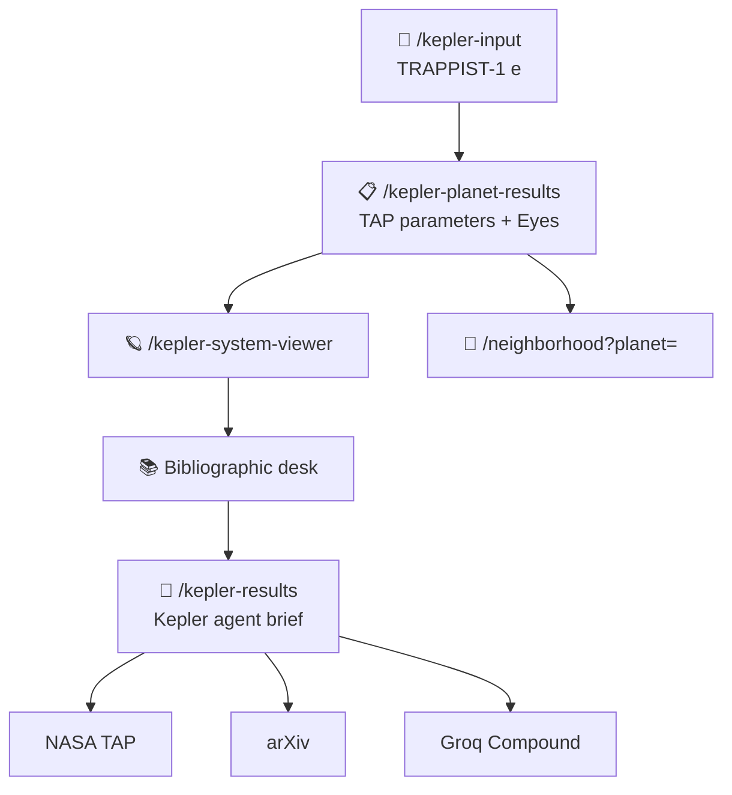
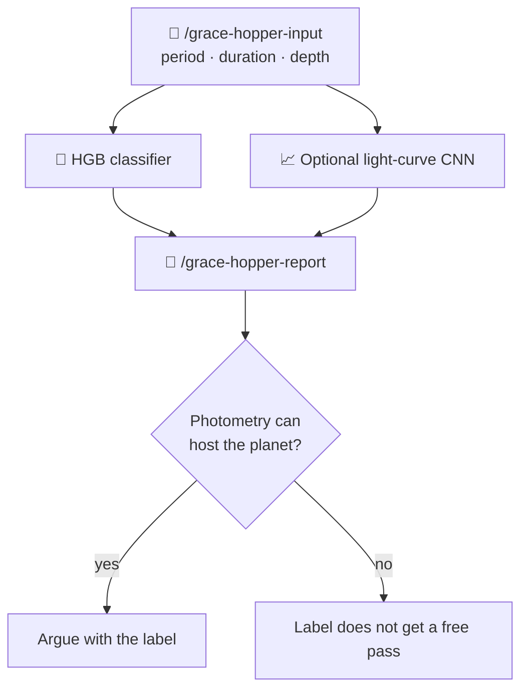
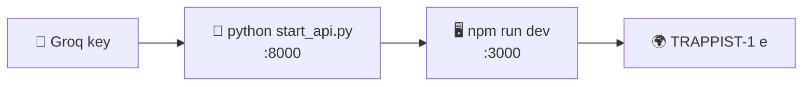

# 🔭 Adhyagnan

<p align="center">
  
</p>

<p align="center">
  <strong>Observatory software for exoplanets.</strong>
</p>

<p align="center">
  <a href="https://www.spaceappschallenge.org/"></a>
  <a href="https://nextjs.org/"></a>
  <a href="https://fastapi.tiangolo.com/"></a>
  <a href="https://groq.com/"></a>
  <a href="https://www.python.org/"></a>
  <a href="https://www.typescriptlang.org/"></a>
</p>

Kepler, K2, and TESS filled the NASA archive with transits. Formats never agreed. Most identification is still a human with a plot. This repo is the desk that sits between those catalogs and a one-page brief: two named agents, published classifiers, NASA Eyes in the same cockpit.

**Hunt exoplanets. Not spreadsheets.**

| | Piece | What it is |
| --- | --- | --- |
| 🖥️ | Cockpit | [astronomia](astronomia) — Next.js 16, TypeScript, dark-space marketing + desks |
| 🤖 | Agents | [ai_agents](ai_agents) — FastAPI, Johannes Kepler, Grace Hopper, TAP, arXiv, Groq |

Built for NASA Space Apps. Groq is the default language key so a classroom can run it without a credit card.

---

## 🗺️ Night pipeline

Ingest mission tables, score the row, argue with physics, then write a brief you can cite.





---

## 🛠️ What it is

| Desk | Job |
| --- | --- |
| 🪐 **Johannes Kepler** | Name a confirmed world (`TRAPPIST-1 e`, `K2-18 b`). Query the NASA Exoplanet Archive, pull arXiv, write the brief. NASA Eyes sits beside the table. |
| 📊 **Grace Hopper** | Give period, depth, duration, stellar context. A HistGradientBoosting label is argued against physics. Optional light-curve CNN. 91% is not a free pass. |
| 🌌 **Sky graph** | Nearby hosts around Sol. Draggable probe ranks nearest systems. Orbital fold, lookback time, inverse-square flux. |
| 🛰️ **Missions** | TESS, JWST, Kepler, Hubble, Spitzer — the photometers behind the rows. Open Eyes from the ops floor. |

Kepler never invents a planet. Hopper never starts from the ML score. Units stay on the number: days, ppm, Kelvin, Earth radii.

### Kepler desk



### Hopper desk



### Models (published, not a press release)

| Instrument | Task | F1 |
| --- | --- | --- |
| 🌲 HistGradientBoosting | Confirmed / candidate / false positive across Kepler, K2, TESS | **83.1%** |
| 📉 AstronetCNN | KOI light-curve ranking | **65%** |

Neither score is a discovery claim.

---

## 🧭 Observatory map

Frontend lives at `http://localhost:3000`.

| Route | What you get |
| --- | --- |
| `/` | 🏠 Home: type hero, star shower, catalog numbers, agent rooms |
| `/features` | ✨ Instruments, night pipeline, TAP / arXiv / Eyes |
| `/roadmap` | 🗺️ Flight plan (shipping vs luck) |
| `/team` | 👥 Kepler, Hopper, builders |
| `/pricing` | 💳 Mission Control (free Groq) · Research Lab (BYOK) · Observatory |
| `/faq` | ❓ TAP spacing, keys, F1 |
| `/learn-more` | 📜 Manifesto |
| `/neighborhood` | 🌌 Neighborhood map, probe, lookback inferences |
| `/exploration-path` | 🛤️ Pick a desk |
| `/kepler-input` | 🔎 Search a NASA name |
| `/kepler-planet-results` | 📋 Parameters + Eyes |
| `/kepler-bibliographic-research` | 📚 Literature desk |
| `/kepler-results` | 🧠 Kepler agent brief |
| `/grace-hopper-input` | 📝 Candidate row, curves, notebooks |
| `/grace-hopper-report` | 📊 Hopper analysis |
| `/mission-dashboard` | 🛰️ Flight ops |

API lives at `http://localhost:8000` (`/docs` for Swagger).

---

## 🧱 Stack

```
astronomia/          Next.js 16 · React 18 · Tailwind 4 · Inter Tight + Instrument Serif
  src/app/           App Router pages
  src/app/components/marketing/   Shared hero, header, CTA, pastel headings
ai_agents/           FastAPI · openai-agents · astroquery · scikit-learn
  astronomist_agents/  Kepler + Hopper
  classifiers/         Tabular + CNN paths
public/              Screenshots and wordmark
```

Language default: **Groq** (`llama-3.3-70b-versatile`, Compound for web). Gemini is the other free path. OpenAI and Perplexity stay optional.

---

## 🚀 Run it tonight

You need **Node 18+**, **Python 3.10+**, and a free **Groq** key: [console.groq.com/keys](https://console.groq.com/keys).



### 🤖 Agents (port 8000)

```bash
cd ai_agents
python -m pip install -r requirements.txt
copy env.example .env
# Windows: copy  |  macOS/Linux: cp env.example .env
```

In `.env`:

```env
LLM_PROVIDER=groq
GROQ_API_KEY=gsk_...
GROQ_MODEL=llama-3.3-70b-versatile
GROQ_WEB_MODEL=groq/compound
GRACE_HOPPER_MODEL_ID=llama-3.3-70b-versatile
```

```bash
python start_api.py
```

Health: `http://localhost:8000/kepler/health`

Gemini instead: set `LLM_PROVIDER=gemini` and `GOOGLE_API_KEY` from [AI Studio](https://aistudio.google.com/apikey).

### 🖥️ Cockpit (port 3000)

```bash
cd astronomia
npm install
npm run dev
```

Open [http://localhost:3000](http://localhost:3000). Try `TRAPPIST-1 e` (space before the letter — that is how NASA stores it). If TAP times out, demo worlds still brief from local ephemerides.

---

## ⚖️ Ground rules

1. The archive is the source. TAP and arXiv get cited. A blank card is better than a invented world.
2. Models are instruments. F1 is public. Overclaiming a transit is a bug, not a slogan.
3. Beginners are first-class. Eyes and a one-line summary are not a toy mode.
4. Keys stay in `ai_agents/.env`. Light curves are not resold.

NASA, Kepler, TESS, JWST, Hubble, Spitzer, and NASA Eyes are names of missions and products of their respective agencies. This project is not an official NASA product.

Data: [NASA Exoplanet Archive](https://exoplanetarchive.ipac.caltech.edu/). Preprints: [arXiv astro-ph](https://arxiv.org/). Visualizations: [NASA Eyes](https://eyes.nasa.gov/).
